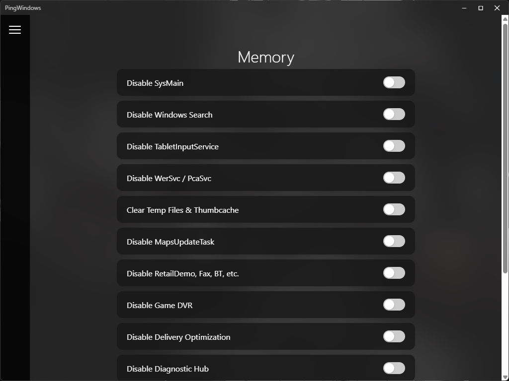
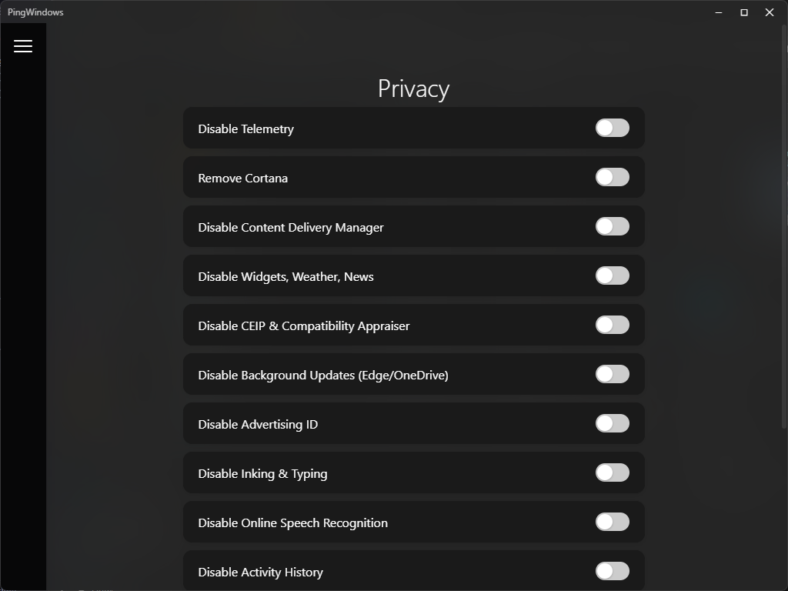
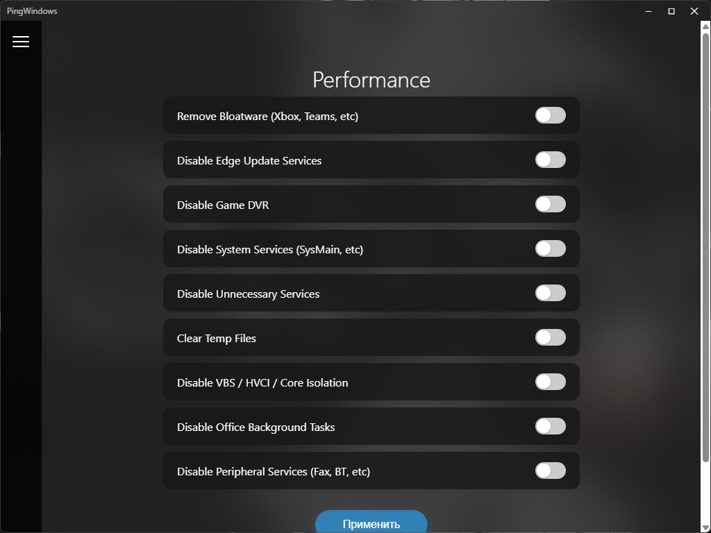
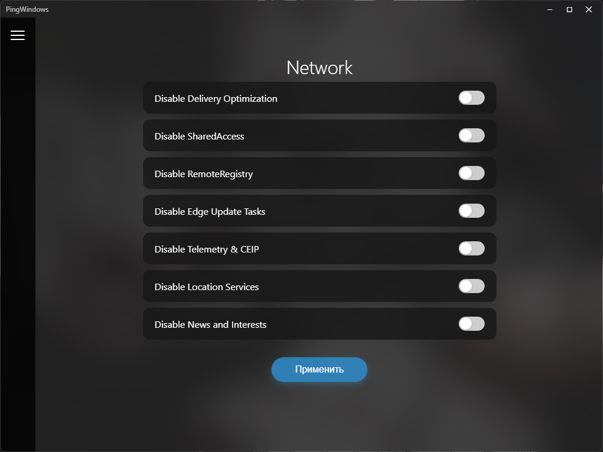
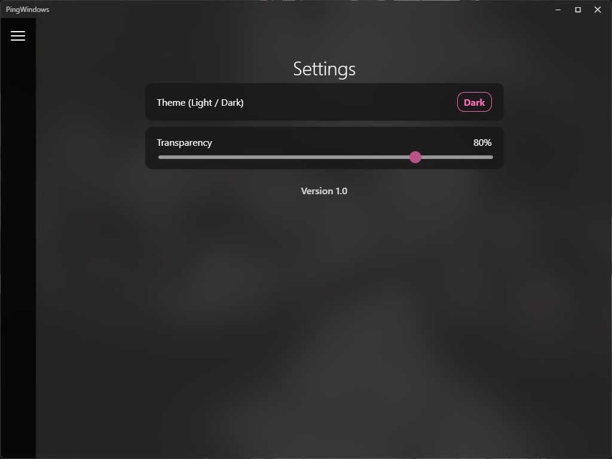

# PingWindows

**PingWindows** — удобный инструмент для управления Windows 10/11, созданный с упором на безопасность и стабильность.  
Цель приложения — предоставить пользователю возможность тонко настраивать систему, **не рискуя что‑то сломать**.

---

## Возможности

PingWindows позволяет быстро и безопасно изменить ключевые параметры системы:

- **Приватность**  
  Управление телеметрией, фоновыми службами, сбором данных и другими параметрами конфиденциальности.

- **Производительность**  
  Отключение ненужных компонентов, оптимизация служб и улучшение отзывчивости системы.

- **Удобство использования**  
  Настройка интерфейса, отключение навязчивых функций и мелкие улучшения для комфорта.

- **И многое другое**  
  Приложение развивается и получает новые функции по мере обновлений.

---

## Основные принципы

- **Безопасность в приоритете** — все изменения проверены и не ломают систему.  
- **Минимум риска** — только безопасные и обратимые настройки.

---

## Установка

1. Перейдите в раздел **Releases**.  
2. Скачайте последнюю версию PingWindows.  
3. Запустите приложение — установка не требуется.

---

## Требования

- Windows 10 или Windows 11  
- Права администратора для применения некоторых настроек

---

## Home

## Memory

## Privacy

## Performance

## Network

## Settings

---

## Наш телеграм канал
[@PingWindows](https://t.me/PingWindows) - в нем вы сможете скачивать PingWindows а так же читать новости об изменениях

## Лицензия

All rights reserved.

## Отказ от ответственности

PingWindows вносит изменения в параметры системы.  
Все функции безопасны, но вы используете приложение на свой страх и риск.
